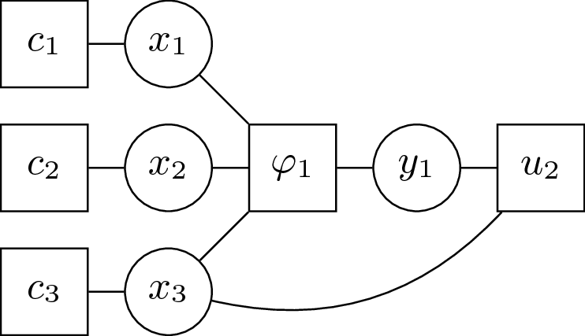

.. _concepts_graph:

DCOP graph models
=================

When solving a DCOP, The first step performed by pyDCOP is to build a graph
of computations.
This **computation graph**  must not be confused with the constraints graph ;
while they may sometime be similar.
The constraints graph is strictly a graph representation of the
Constraints Optimization Problem (COP) while the **computation graph**
depends on the method (aka algorithm) used to solve this problem.

A computation graph is a graph
where vertices represent **computations**
and edges represent **communication** between these computations.
Computation send and receive messages one with another,
along the edges of the graph.
Computations are defined as the basic unit of work needed when solving a DCOP,
their exact definition depends on the algorithm used.
Most algorithms define computations for the decision variables of the DCOP,
but some algorithm can define computations for constraints as well,
or even groups of variables.

Pydcop defines at the moment 3 kinds of computation graphs:

 * Constraints hyper-graph
 * Pseudo-tree (aka DFS Tree)
 * Factor graph

When solving a DCOP, as each algorithm require a specific type of graph,
pydcop can automatically infer the computation graph model from the algorithm
you're using.

Constraints hyper-graph
-----------------------

This is the most straightforward computation graph and is used with
algorithms that define one computation for each variable.
In a constraints graph  vertices (i.e. computations) directly maps to the
variables of the DCOP and edges maps to constraints.
As a classical constraint graph can only represents binary constraints,
pyDCOP uses an hyper-graph, where hyper-edges can represent n-ary constraints.

The kind of graph is used by algorithms like
:ref:`MGM <implementation_reference_algorithms_mgm>`,
:ref:`DSA <implementation_reference_algorithms_dsa>`, etc.

.. _concept_factor_graph:

Factor graph
------------

A factor graph is an  undirected bipartite graph in which vertices represent
variables and constraints (called factors),
and an edge exists between a variable and a constraint
if the variable is in the scope of the constraint.

Factors graph are used for algorithms that define computations for variables
and for constraints. This is typically the caase of
:ref:`MaxSum <implementation_reference_algorithms_maxsum>` and
most GDL-based algorithms.

  An example of a Factor graph
  (from :cite:`rust_using_2016`)

DFS tree
--------

DFS trees are a subclass of pseudotrees, built a depth-first
traversal of the constraint graph (where vertices represent variables and
edges represent constraints).
In addition to the parent/children edges of the tree,
they contains pseudo-parent/ pseudo-children edges, which correspond to the
edges (aka constraints) of the orginal graph that would othrwise not be
represented in a simple tree.

The only algorithm currently implemented in pyDCOP that uses a DFS tree
computation graph is
:ref:`DPOP <implementation_reference_algorithms_dpop>`

.. figure:: dfs_tree.png
  :width: 90%
  :align: center
  :alt: factor graph
  :figclass: align-center

  An example of a DFS tree representing a constraint graph
  (from :cite:`petcu_class_2007`)

Implementing a new graph model
------------------------------

A module for a computation graph type typically contains

* class(es) representing the nodes of the graph (i.e. the computation),
  extending ComputationNode

* class representing the edges (extending Link)

* a class representing the graph

* a (mandatory) method  to build a computation graph from a Dcop object :

    def build_computation_graph(dcop: DCOP)-> ComputationPseudoTree:
