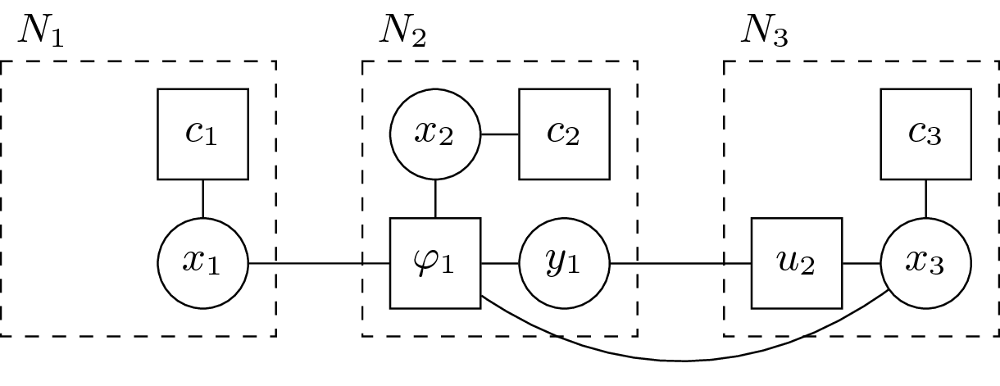

.. _concepts_distribution:

DCOP computation distribution
==============================

Before running the DCOP, the computation must be deployed on agents.
We name **distribution** the task of assigning each computation to one agent,
which will be responsible for hosting and running the computation.

When you look at the standard DCOP definition,
:math:`\langle \mathcal{A}, \mathcal{X}, \mathcal{D}, \mathcal{C}, \mu \rangle`,
pyDCOP's **distribution** can be seen as a generalization of the
mapping function :math:`\mu: \mathcal{X} \rightarrow \mathcal{A}`
used to assign variables to agents.

In classical DCOP approaches, there is exactly one agent for each variable
and most DCOP algorithms define one computation for each variable.
In that case, the distribution of these computations is of course trivial.
The :ref:`oneagent <implementation_reference_distributions_oneagent>`
distribution replicates this traditional hypothesis in pyDCOP
and might be enough if you do not care about distribution issues and
simply want to develop or benchmark classical DCOP algorithms.

However, some DCOP algorithms (for example MaxSum) not only define computations
for variable, but also for constraints.
These computations then form a
:ref:`factor graph <concept_factor_graph>`
like the one on :numref:`factor_graph`:

.. _factor_graph:
.. figure:: factor_graph.png
  :width: 50%
  :align: center
  :alt: factor graph
  :figclass: align-center

  Sample factor graph with 4 variables and 5 constraints

In this situation, one must also assign factor-computation to agent, and
there is no obvious mapping. :numref:`fg_dist`: is a possible distribution
of this factor graph on 3 agents but is obvously not the only possible one.

.. _fg_dist:

  One possible distribution of the factor graph on agents

And even with algorithms that only define computations for variables,
the standard assumptions do not hold on many real world problems.
Agents typically maps to physical computers or devices
and the number of these devices is not necessarily equal
to the number of decision variables in the DCOP.
Moreover, some variables have a physical link to devices
(in the sense, for example, that they model an action or decision
of this particular device)
while some other variables might simply be used to model
an abstract concept in the problem and have no real relationship
with physical devices.

Finally the placement of computations on the agents has an important impact on
the performance characteristics of the global system:
some distributions may improve response time,
some other may favor communication load between nodes
and some other may be better for other criteria like QoS or running cost.

Formally, once the definition of optimality has been defined for a specific
problem,
finding an optimal mapping is an optimization problem by itself,
which can be mapped to graph partitioning and
this typically falls under the category of NP-hard problems.

For all these reasons, the distribution of computations on agents is
an interesting topic, which is implemented in pyDCOP through distribution
methods.
See :cite:`rust_using_2016` :cite:`rust_deployment_2017` and
:cite:`rust_self-organized_2018` for background and
details on the deployment and distribution of computations in a DCOP.

pyDCOP currently implements several distribution methods, you can find the
full list in the
:ref:`reference documentation <implementation_reference_distributions>`.