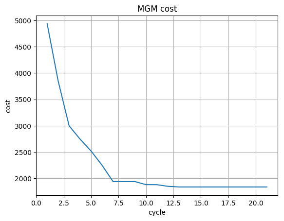

.. _tutorials_analysing_results:

Analysing results
=================

End results
-----------

In the :ref:`first tutorial<tutorials_getting_started>` you solved a very
simple DCOP using the following command::

  pydcop solve --algo dpop graph_coloring.yaml

This command outputs many results, given in json so that you can parse then
easily, for example when writing more complex scripts for
experimentations.
You can also get these results directly in a file using the ``--output`` global
option (see. :ref:`pyDcop cli dcoumentation<usage_cli_ref_options>`)::

  pydcop --output results.json solve --algo dpop graph_coloring.yaml

You may have noticed that, even though the DCOP has only 3 variables and a
handful of constraints, the results is quite long and contains a lot of
information.

At the top level you can find global results, which apply to the DCOP as a
whole::

    {
      "agt_metrics": {
        // metrics for each agent, see below
      },
      "assignment": {
        "v1": "R",
        "v2": "G",
        "v3": "R"
      },
      "cost": -0.1,
      "cycle": 1,
      "msg_count": 29,
      "msg_size": 8,
      "status": "FINISHED",
      "time": 0.006329163996269926,
      "violation": 0
    }

* ``status``: indicates how the command was stopped, can be one of

  * ``FINISHED``, when all computation finished,
  * ``TIMEOUT``, when the command was interrupted because it reached timeout
    set with the ``--timeout`` option,
  * ``STOPPED``, when the command was interrupted with ``CTRL+C``.

* ``assignment``: contains the assignment that was found by the DCOP
  algorithm.
* ``cost``: the cost for this assignment (i.e. the sum of the cost of all
  constraints in the DCOP).
* ``violation``: the number of violated hard constraints, when using DCOP with a
  mix of soft and hard constraints (hard constraints support is still in
  experimental stage and not documented).
* ``msg_size``: the total size of messages exchanged between agents.
* ``msg_count``: the number of messages exchanged between agents.
* ``time``: the elapsed time, in second.
* ``cycles``, the number of cycles for  DCOP computations.
  In this example it is always 0 has DPOP has no notion of cycle.

The ``agt_metrics`` section contains one entry for each of the agents in the
DCOP. Each of these entries contains several items::

    "a1": {
      "activity_ratio": 0.24987247830102727,
      "count_ext_msg": {
        "v2": 2
      },
      "cycles": {
        "v2": 0
      },
      "size_ext_msg": {
        "v2": 4
      }
    },

* ``count_ext_msg`` and ``size_ext_msg``, which contain count and size of
  messages sent and received by each DCOP computations hosted on this agent
* ``cycles``, the number of cycles for each DCOP computation hosted on this
  agent.
  In this example it is always 0 has DPOP has no notion of cycle.
* ``activity_ratio``, the ratio of *active time* on total elapsed time,
   where active time is defined as the time the agent spent handling a
   message (as opposed to waiting for messages).

Run-time metrics
----------------

The output of the :ref:`solve<pydcop_commands_solve>` command only gives you
the end results of the command, but sometime you need to know what happens
*during* the execution of the DCOP algorithm.
pyDCOP is able to collect metrics at different events during the DCOP execution.
You must use the ``--collect_on`` option to select
when you want metrics to be captured:

* ``cycle_change``: metrics are collected every time the algorithm switch
  from one cycle (aka iteration) to the next one.
  This mode only makes sense with algorithms which have a notion of cycle.
* ``period``: metrics are collected periodically , for each agent (meaning
  your will have line of metric for each agent and for each period).
  When using this mode, you **must** also set ``--period`` to set the
  metrics collection period (in second).
* ``value_change``: metrics are collected every time a new value is selected
  for a variable.

When collecting run-time metrics, you also need to use the
``--run_metrics <file>`` option
to indicates the file where the metrics must be written.
One csv line is written in this file for each metric collection.
These lines contains the following columns:
``time, cycle, cost, violation, msg_count, msg_size, status``
, where the definition of these metrics are the same than for end-results.

For example, this line contains metrics from cycle 14 and the solution at
this point has a cost of 0.1::

  time, cycle, cost, violation, msg_count, msg_size, status
  0.10148727701744065, 14, 0.1, 0, 112, 112, RUNNING

.. warning:: Be careful when collecting metrics with a large number of agents.
  For example, A ``--period`` of 0.1 means
  each agent will send its metrics 10 times per second.
  If you have 100 agents, collecting 1000 metrics per second will slow you
  down quite a bit and could even give invalid results if all these metrics
  could not be handled and written before the end of the timeout.

  If you want to assess the overall time needed to solve a problem,
  it is better not to collect run time metrics at the same time.
  In that case, you should only rely on the end-metrics,
  which does not influence the execution of the algorithm.

Examples
^^^^^^^^

For more interesting results, we use a bigger DCOP in these samples:
:download:`graph_coloring_50.yaml<graph_coloring_50.yaml>`
It's a graph coloring problem with 50 variables, generated with the
:ref:`generate command<pydcop_commands_generate>` :

Solving with MGM (stopping after 20 cycles), collecting metrics on every cycle
change::

  pydcop solve --algo mgm --algo_params stop_cycle:20 \
               --collect_on cycle_change --run_metric ./metrics.csv \
               graph_coloring_50.yaml

Solving with MGM during 5 seconds, collecting metrics every 0.2 second::

  pydcop -t 5  solve --algo mgm --collect_on period --period 0.2 \
                     --run_metric ./metrics_on_period.csv \
                     graph_coloring_50.yaml

Solving with MGM during 5 seconds, collecting metrics every time a new value
is selected::

  pydcop -t 5  solve --algo mgm  --collect_on value_change \
                     --run_metric ./metrics_on_value.csv \
                     graph_coloring_50.yaml

Plotting the results
--------------------

pyDCOP has not builtin utility to plot the metrics generated by the
:ref:`solve<pydcop_commands_solve>` command. However, using the generated
csv files, it's very easy to generate graphs for these metrics using
any of the commonly used plot utility like `gnu-plot <http://gnuplot.info/>`_,
`R <https://www.r-project.org/>`_, `matplotlib <https://matplotlib.org/>`_, etc.

For example, if you generate cycle metrics when solving the graph coloring
dcop with MGM::

  pydcop solve --algo mgm --algo_params stop_cycle:20 \
               --collect_on cycle_change \
               --run_metric ./metrics_cycle.csv \
               graph_coloring_50.yaml

This should give you a metric file similar to
:download:`this one<metrics_cycle.csv>`.
You can now plot the cost of the solution over cycles.
Notice that the cost is always decreasing, as MGM is monotonous::

  import matplotlib.pyplot as plt
  import numpy as np

  data = np.genfromtxt('metrics_cycle.csv', delimiter=',',
                       names=['t', 'cycle', 'cost', 'violation' ,
                              'msg_count', 'msg_size', 'status'])

  fig, ax = plt.subplots()
  ax.plot(data['t'], data['cost'], label='cost MGM')
  ax.set(xlabel='cycle', ylabel='cost')
  ax.grid()
  plt.title("MGM cost")

  fig.savefig("mgm_cost.png", bbox_inches='tight')
  plt.legend()
  plt.show()

    MGM solution cost over 20 cycles.

For course, before running this example, you need to install matplotlib::

  pip install matplotlib

Logs
----

By default, the :ref:`solve<pydcop_commands_solve>` command (like all other
pyDCOP commands) only outputs the results (here, the end metrics) and does
not output any log, except if there are errors.
You can enable  logs by adding the ``-v``
:ref:`global option<usage_cli_ref_options>` with the requested level::

  pydcop -v 2 solve --algo dpop graph_coloring.yaml

Level 1 displays only warnings messages, level 2 displays warnings and info
messages and level 3 all messages (and can be quite verbose! )

For more control over logs, you can use the ``--log <conf_file>``
:ref:`option<usage_cli_ref_options>`, where ``conf_file`` is a
`standard python log configuration file <https://docs
.python.org/3/library/logging.config.html#configuration-file-format>`_::

  pydcop --log algo_logs.conf solve --algo dpop graph_coloring.yaml

For example, using :download:`this long configuration file<algo_logs.conf>`,
all logs from DPOP computations will be logged in a ``agents.log`` file,
without any log from the pyDCOP infrastructure
(discovery, messaging, etc.).
This can be very useful to analyse an algorithm's behavior.
When solving our graph coloring problem with DPOP, you should get a log file
containing something similar to this::

  pydcop.algo.dpop.v3 -  Leaf v3 prepares init message v3 -> v2
  pydcop.algo.dpop.v2 -  Util message from v3 : NAryMatrixRelation(None, ['v2'], [-0.1  0.1])
  pydcop.algo.dpop.v2 -  On UTIL message from v3, send UTILS msg to parent ['v3']
  pydcop.algo.dpop.v1 -  Util message from v2 : NAryMatrixRelation(None, ['v1'], [0. 0.])
  pydcop.algo.dpop.v1 -  ROOT: On UNTIL message from v2, send value msg to childrens ['v2']
  pydcop.algo.dpop.v1 -  Selecting new value: R, -0.1 (previous: None, None)
  pydcop.algo.dpop.v1 -  Value selected at v1 : R - -0.1
  pydcop.algo.dpop.v2 -  v2: on value message from v1 : "DpopMessage(VALUE, ([Variable(v1, None, VariableDomain(colors))], ['R']))"
  pydcop.algo.dpop.v2 -  Slicing relation on {'v1': 'R'}
  pydcop.algo.dpop.v2 -  Relation after slicing NAryMatrixRelation (joined_utils, ['v2'])
  pydcop.algo.dpop.v2 -  Selecting new value: G, 0.0 (previous: None, None)
  pydcop.algo.dpop.v2 -  Value selected at v2 : G - 0.0
  pydcop.algo.dpop.v3 -  v3: on value message from v2 : "DpopMessage(VALUE, ([Variable(v2, None, VariableDomain(colors))], ['G']))"
  pydcop.algo.dpop.v3 -  Slicing relation on {'v2': 'G'}
  pydcop.algo.dpop.v3 -  Relation after slicing NAryMatrixRelation(joined_utils, ['v3'])
  pydcop.algo.dpop.v3 -  Selecting new value: R, 0.1 (previous: None, None)
  pydcop.algo.dpop.v3 -  Value selected at v3 : R - 0.1

