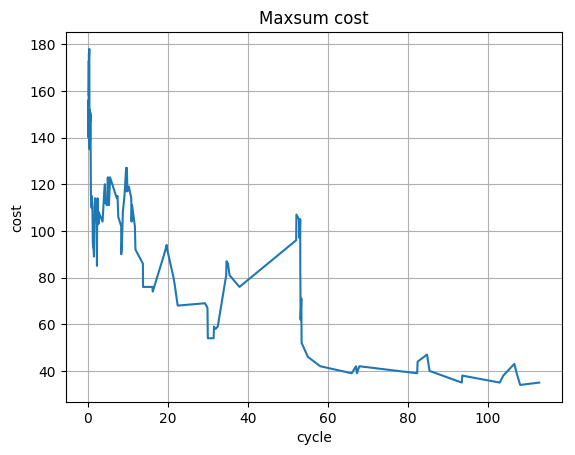

.. _tutorials_dynamic_dcops:

Dynamic DCOPs
=============

All the DCOPs we have seen in previous tutorial are *static DCOPs* :
the problem definition (variables and constraints)
and the set of agents are supposed to be stable during the solving process.

However, as for most distributed systems,
DCOPs are often used on problems where the environment is dynamic in nature.
Agents may enter or leave the system at any time,
the problem itself may evolve *while* it is been worked on,
and the system needs to adapt to these changes.
We call such problems **dynamic DCOP**
(see. :ref:`concepts_resilient_dcop`).

The :ref:`solve<pydcop_commands_solve>` command deals with static DCOP,
the :ref:`run<pydcop_commands_run>` command supports running **dynamic DCOP**.

DCOP and scenario
-----------------

Running a dynamic DCOP requires injecting events in the system,
otherwise it would be the exact same thing as running a static DCOP
using the :ref:`solve<pydcop_commands_solve>` command.

In order to run and evaluate DCOP solution methods in dynamic environments,
pyDCOP defines the notion of **scenario**, which is an ordered collection of
events that are injected in the system while it is running.
Scenario can be :ref:`written in yaml<usage_file_formats_scenario>`.
Each event in the scenario is either a **delay**,
during which the system runs without any perturbation,
of a collection of **actions**.
For example, in the following scenario,
the agent a008 is removed after a 30 seconds delay::

 events:
   - id: w1
     delay: 30

   - id: e1
     actions:
       - type: remove_agent
         agent: a008

Removing an agent is the only action supported at the moment
(but that should change soon!) .
Other actions could be:

* changing a constraint value table (the cost of the constraint for a given
  assignment)
* modifying the scope and arity of a constraint
* changing the value of a *read-only* variable

Currently pyDCOP has a partial implementation for these kinds of events,
which are not yet available through the command line interface.

Also, pyDCOP implementation *simulates* dynamic DCOPs,
which allows evaluating algorithms (for resilient DCOP for example) but does
entirely support a real dynamic behavior
where events happen in the environment
and are *sensed* at agent level.

The consequence it that removing an agent can only be done through a scenario:
if you manually remove an agent from the system
(by stopping it's ``pydcop agent`` command)
the computations will not be migrated and the system will malfunction.
Supporting removal like this would require a distributed *discovery mechanism*,
with *keep alive* messages, in order to be able to detect when an agent
is not available.
This mechanism is not (yet) implemented in pyDCOP and all events are injected
through the orchestrator.

Resiliency and replication
--------------------------

As pyDCOP implementation is currently focused on resilience,
the run command automatically deploy and run a resilient DCOP.

This means that all the computations for the DCOP are automatically
replicated on several agents. Without this step, we would loose computation
when injecting ``remove_agent`` events, and the system would stop working
properly.
The resiliency level and replication method can be selected
when using the :ref:`run<pydcop_commands_run>`  command,
but for now, you don't need to bother with these as safe default values are
provided.

For more information on resiliency, replication and reparation, see
:ref:`concepts_resilient_dcop`

Running the dynamic DCOP
------------------------

We can now run our dynamic DCOP using the following command::

  pydcop -t 120 --log log.conf run \
         --algo maxsum --algo_params damping:0.9 \
         --collect_on value_change --run_metric metrics_value_maxsum.csv \
         --distribution heur_comhost \
         --scenario scenario_2.yaml \
         graph_coloring_20.yaml

When running this command, the following steps are performed :

* Building the computation graph required for the DCOP algorithm. Here
  it is a factor graph with one computation for each variable and factor (aka
  constraint) in the DCOP
* Computing an initial distribution of these computations on the the agents,
  using the heuristic ``heur_comhost`` based on communication and hosting costs
* replicating all computations on other agents, using the DRPM replication
  method (from :cite:`rust_self-organized_2018`)
* injecting delays and events from the scenario.
  After each event the system is repaired, which includes:

  * For each of the computations that were hosted on a departed agent,
    activating one of its replicas
  * Repairing the replication by creating new replicas for all computations that
    were replicated on a departed agent

You can try it on your computer using the following files:

* dcop:
  :download:`graph_coloring_20.yaml<dynamic_dcop_res/graph_coloring_20.yaml>`
  We use here a weighted graph coloring problem. Agents defined in this
  DCOP have a *capacity*, *hosting costs* and *communication costs*, which are
  used when computing the distribution
* scenario: :download:`scenario_2.yaml<dynamic_dcop_res/scenario_2.yaml>`
  this scenario contains 3 events, where
* log configuration file: :download:`log.conf<dynamic_dcop_res/log.conf>`

Results
-------

We can plot the results as we did in
:ref:`a previous tutorial<tutorials_analysing_results>`.
Use :download:`this script<dynamic_dcop_res/dyndcop_graph_maxsum.py>`
if you're not confortable with matplotlib.
As we can see, the system keeps running, and the solution improves,
even though we removed agents:

    Solution cost when running MaxSum on dynamic DCOP

In addition to the usual run-time metrics,
the :ref:`run<pydcop_commands_run>` command also outputs,
after each event and reparation, the new distribution of the system.
The :ref:`format<usage_file_formats_distribution>`   is the same as with the
:ref:`distribute<pydcop_commands_distribute>` command.

With our example, 3 distribution files are created:
``evtdist_0.yaml``, ``evtdist_1.yaml``, ``evtdist_2.yaml``.
You can open them and see how computations were moved from one agent to
another after each event.

Notice that we use here
:ref:`maxsum<implementation_reference_algorithms_maxsum>` to solve our
distributed DCOP ;
as we remove agents at run-time, the algorithm must be able to cope with
message loss, which is not the case with synchronous algorithms like DSA or MGM.

Finally, you may have noticed that
the end results contains some variables
that were not part of our initial DCOP , like for example
``Bc001_005_a002``.

These are binary variables used to select the agent
where an orphaned computation should be migrated.
As a matter of fact, the reparation of our DCOP is a distributed problem,
which is it-self implemented with another DCOP !
See. :cite:`rust_self-organized_2018` for more details::

  {
    ...
    "assignment": {
      "Bc001_005_a002": 1,
      "Bc001_005_a008": 0,
      "Bc001_005_a015": 0,
      "Bc001_010_a002": 0,
      "Bc001_010_a011": 0,
      "Bc001_010_a018": 1,
      "Bc003_004_a002": 0,
      "Bc003_004_a014": 1,
      "Bc003_004_a018": 0,
      "Bc003_010_a013": 1,
      "Bc003_010_a016": 0,
      "Bc003_010_a018": 0,
      "Bc005_016_a004": 0,
      "Bc005_016_a005": 1,
      "Bc005_016_a013": 0,
      "Bc010_011_a000": 0,
      "Bc010_011_a005": 0,
      "Bc010_011_a011": 1,
      "Bc010_012_a004": 1,
      "Bc010_012_a005": 0,
      "Bc010_012_a011": 0,
      "Bc010_017_a002": 0,
      "Bc010_017_a004": 0,
      "Bc010_017_a007": 1,
      "Bc010_019_a000": 0,
      "Bc010_019_a003": 1,
      "Bc010_019_a013": 0,
      "Bv001_a005": 0,
      "Bv001_a009": 1,
      "Bv001_a018": 0,
      "Bv005_a005": 1,
      "Bv005_a009": 0,
      "Bv005_a016": 0,
      "Bv010_a009": 0,
      "Bv010_a015": 0,
      "Bv010_a018": 1,
      "Bv017_a011": 0,
      "Bv017_a016": 0,
      "Bv017_a017": 1,
      "Bv019_a012": 0,
      "Bv019_a014": 1,
      "Bv019_a019": 0,
      "v000": 2,
      "v001": 0,
      "v002": 5,
      "v003": 7,
      "v004": 2,
      "v005": 2,
      "v006": 2,
      "v007": 0,
      "v008": 5,
      "v009": 4,
      "v010": 5,
      "v011": 2,
      "v012": 0,
      "v013": 9,
      "v014": 4,
      "v015": 8,
      "v016": 0,
      "v017": 5,
      "v018": 6,
      "v019": 3
    },
    "cost": 35,
    "cycle": 0,
    "msg_count": 23529,
    "msg_size": 470580,
    "status": "TIMEOUT",
    "time": 120.01458694699977,
    "violation": 0
  }

